# DER — SISZOO

### Diagrama Entidade-Relacionamento · Sistema de Gestão do CCZ-Itu

> Documento de referência derivado das **15 telas + Design System** do protótipo navegável. Use-o para comparar com seu schema atual e validar cobertura.

**Convenções**

- `PK` chave primária · `FK` chave estrangeira · `?` opcional (nullable) · `*` obrigatório
- `enum` valor de tabela-domínio (catálogo)
- Datas em UTC, exibição em America/São_Paulo (DD/MM/AAAA — fixo)
- Idioma: PT-BR somente
- Bairro: campo livre (sem catálogo fechado)

---

## 1. Visão geral — telas × módulos

| Tela                                                                 | Módulo                 | Entidades-chave                                                                                                  |
| -------------------------------------------------------------------- | ---------------------- | ---------------------------------------------------------------------------------------------------------------- |
| `login.html`                                                         | Autenticação           | `usuario`, `sessao`                                                                                              |
| `dashboard.html`                                                     | Agregações             | views/derivadas de quase tudo                                                                                    |
| `alerta.html`                                                        | Alertas (detalhe)      | `alerta_*` (computado)                                                                                           |
| `animais.html` / `animal.html` / `cadastrar-animal.html`             | Animais                | `animal`, `vacinacao`, `procedimento`, `medicacao`, `exame`, `adocao`                                            |
| `ocorrencias.html` / `ocorrencia.html` / `cadastrar-ocorrencia.html` | Ocorrências            | `ocorrencia`, `denunciante`, `denunciado`, `movimentacao_ocorrencia`, `anexo_ocorrencia`                         |
| `processos.html` / `processo.html` / `cadastrar-processo.html`       | Processos Sanitários   | `processo_sanitario`, `responsavel_processo`, `animal_amostrado`, `documento_processo`, `resultado_laboratorial` |
| `baias.html`                                                         | Infraestrutura         | `baia`                                                                                                           |
| `usuarios.html`                                                      | Administração          | `usuario`, `perfil`                                                                                              |
| `relatorios.html` + `relatorios/*`                                   | Relatórios             | `relatorio_gerado`, `tipo_relatorio`                                                                             |
| `configuracoes.html`                                                 | Preferências/catálogos | `preferencia_usuario`, `catalogo_*`, `auditoria_evento`                                                          |

---

## 2. Diagrama (Mermaid ER)

> Cole em qualquer renderer Mermaid (Mermaid Live, VSCode, GitHub) ou no [mermaid.ink](https://mermaid.ink) para gerar PNG.

```mermaid
erDiagram

  %% ============ USUÁRIOS / SEGURANÇA ============
  USUARIO ||--o{ SESSAO : "abre"
  USUARIO ||--o{ USUARIO_CARGO : "recebe"
  CARGO ||--o{ USUARIO_CARGO : "concedido via"
  USUARIO ||--|| PREFERENCIA_USUARIO : "configura"
  USUARIO ||--o{ AUDITORIA_EVENTO : "produz"
  CARGO ||--o{ CARGO_PERMISSAO : "concede"

  %% ============ ANIMAIS ============
  ANIMAL }o--|| ESPECIE : "é"
  ANIMAL }o--|| STATUS_ANIMAL : "está"
  ANIMAL }o--|| MOTIVO_ENTRADA : "entrou por"
  ANIMAL }o--o| BAIA : "ocupa"
  ANIMAL ||--o{ VACINACAO : "recebeu"
  ANIMAL ||--o{ PROCEDIMENTO : "passou"
  ANIMAL ||--o{ MEDICACAO : "toma"
  ANIMAL ||--o{ EXAME : "tem"
  ANIMAL ||--o| ADOCAO : "foi adotado em"
  ANIMAL ||--o{ ANIMAL_AMOSTRADO : "é amostrado em"
  ANIMAL ||--o{ ANEXO_ANIMAL : "tem"

  VACINACAO }o--|| VACINA : "do tipo"
  VACINACAO }o--|| USUARIO : "aplicada por"
  PROCEDIMENTO }o--|| TIPO_PROCEDIMENTO : "do tipo"
  PROCEDIMENTO }o--|| USUARIO : "executado por"
  MEDICACAO }o--|| USUARIO : "prescrita por"
  EXAME }o--|| LABORATORIO : "executado em"

  %% ============ BAIA / INFRAESTRUTURA ============
  BAIA }o--|| TIPO_BAIA : "categoria"

  %% ============ OCORRÊNCIAS ============
  OCORRENCIA }o--|| TIPO_OCORRENCIA : "classificada como"
  OCORRENCIA }o--|| STATUS_OCORRENCIA : "está"
  OCORRENCIA }o--o| PROVIDENCIA_TOMADA : "encerrada com"
  OCORRENCIA }o--|| USUARIO : "registrada por"
  OCORRENCIA }o--o| USUARIO : "encerrada por"
  OCORRENCIA ||--o| DENUNCIANTE : "tem"
  OCORRENCIA ||--o| DENUNCIADO : "aponta"
  OCORRENCIA ||--o{ MOVIMENTACAO_OCORRENCIA : "histórico"
  OCORRENCIA ||--o{ ANEXO_OCORRENCIA : "anexos"
  OCORRENCIA ||--o| PROCESSO_SANITARIO : "gera"

  %% ============ PROCESSO SANITÁRIO ============
  PROCESSO_SANITARIO }o--|| DOENCA : "investiga"
  PROCESSO_SANITARIO }o--|| LABORATORIO : "envia para"
  PROCESSO_SANITARIO }o--|| STATUS_PROCESSO : "está"
  PROCESSO_SANITARIO }o--o| RESULTADO_LABORATORIAL : "resultado"
  PROCESSO_SANITARIO }o--o| DESFECHO_ANIMAL : "desfecho"
  PROCESSO_SANITARIO }o--|| USUARIO : "responsável"
  PROCESSO_SANITARIO ||--|| RESPONSAVEL_PROCESSO : "responsável/munícipe"
  PROCESSO_SANITARIO ||--o{ ANIMAL_AMOSTRADO : "amostra"
  PROCESSO_SANITARIO ||--o{ DOCUMENTO_PROCESSO : "documentos"

  ANIMAL_AMOSTRADO ||--o{ AMOSTRA_SINTOMA : "apresenta"
  AMOSTRA_SINTOMA }o--|| SINTOMA : "do tipo"

  %% ============ RELATÓRIOS ============
  RELATORIO_GERADO }o--|| TIPO_RELATORIO : "do tipo"
  RELATORIO_GERADO }o--|| USUARIO : "gerado por"

  %% ============ ALERTAS (computados) ============
  ALERTA ||--o{ ALERTA_ITEM : "agrupa"
  ALERTA_ITEM }o--o| ANIMAL : "sobre"
  ALERTA_ITEM }o--o| BAIA : "sobre"

  %% ============ AUDITORIA ============
  AUDITORIA_EVENTO }o--|| USUARIO : "feito por"
```

---

## 3. Entidades — detalhamento

### 3.1 Segurança / Usuários

#### `usuario`

| Campo                | Tipo         | Obrig. | Observações                     |
| --------------------- | ------------ | ------ | ------------------------------- |
| `id`                  | uuid PK      | \*     |                                 |
| `email`               | varchar(255) | \*     | Único · sufixo `@itu.sp.gov.br` |
| `senha`               | varchar(255) | \*     | hash bcrypt                     |
| `nome`                | varchar(100) | \*     |                                 |
| `sobrenome`           | varchar(100) | \*     |                                 |
| `crmv`                | varchar(20)  | ?      | Quando cargo = Veterinário      |
| `telefone`            | varchar(20)  | ?      |                                 |
| `ativo`               | boolean      | \*     | default `true`                  |
| `dois_fatores_ativo`  | boolean      | \*     | default `false`                 |
| `ultimo_acesso`       | timestamp    | ?      |                                 |
| `criado_em`           | timestamp    | \*     |                                 |
| `senha_alterada_em`   | timestamp    | ?      | NULL = força troca no 1º acesso |
| `desativado_em`       | timestamp    | ?      | soft-delete                     |
| `data_modificacao`    | timestamp    | \*     | atualizado a cada alteração do registro |

**Regras**

- E-mail deve casar regex `^[a-z.]+@itu\.sp\.gov\.br$` (institucional).
- Cargo `recepcionista` foi removido do escopo — não criar mais.
- Apenas cargo `Administrador` pode criar / desativar usuários e ver dados de denunciante em ocorrências sigilosas.
- Nenhum usuário, incluindo Administrador, pode desativar a si mesmo (bloqueado no backend, HTTP 422).

#### `cargo`

| Campo       | Tipo         | Obrig. | Observações                                        |
| ----------- | ------------ | ------ | -------------------------------------------------- |
| `id`        | uuid PK      | \*     |                                                    |
| `nome`      | varchar(100) | \*     | "Administrador", "Veterinário", "Agente Sanitário" |
| `descricao` | text         | ?      |                                                    |

#### `usuario_cargo`

> Tabela associativa — um usuário pode acumular mais de um cargo (N:N).

| Campo           | Tipo         | Obrig. | Observações  |
| --------------- | ------------ | ------ | ------------ |
| `usuario_id`    | FK `usuario` PK | \* |              |
| `cargo_id`      | FK `cargo` PK   | \* |              |
| `adicionado_em` | timestamp    | \*     |              |

#### `cargo_permissao`

| Campo      | Tipo         | Obrig. | Observações                                                                              |
| ---------- | ------------ | ------ | ----------------------------------------------------------------------------------------- |
| `id`       | uuid PK      | \*     |                                                                                            |
| `cargo_id` | FK `cargo`   | \*     |                                                                                            |
| `modulo`   | enum         | \*     | `USUARIOS_ACESSO`, `GESTAO_ANIMAIS`, `OCORRENCIAS_DENUNCIAS`, `PROCESSOS_SANITARIOS`, `RELATORIOS` |
| `feature`  | varchar(100) | \*     | granularidade dentro do módulo (ex.: `geral`)                                             |
| `leitura`  | boolean      | \*     |                                                                                            |
| `escrita`  | boolean      | \*     |                                                                                            |
| `exclusao` | boolean      | \*     |                                                                                            |

Único: (`cargo_id`, `modulo`, `feature`).

**Matriz padrão** (referência):

| Módulo      | Admin | Vet | Agente |
| ----------- | ----- | --- | ------ |
| animais     | RWD   | RW  | R      |
| ocorrencias | RWD   | R   | RW     |
| processos   | RWD   | RW  | RW     |
| relatorios  | R     | R   | R      |
| usuarios    | RWD   | —   | —      |

#### `sessao`

| Campo          | Tipo         | Obrig. | Observações |
| -------------- | ------------ | ------ | ----------- |
| `id`           | uuid PK      | \*     |             |
| `usuario_id`   | FK `usuario` | \*     |             |
| `token_hash`   | varchar(512) | \*     |             |
| `ip`           | varchar(45)  | ?      |             |
| `user_agent`   | text         | ?      |             |
| `criada_em`    | timestamp    | \*     |             |
| `expira_em`    | timestamp    | \*     |             |
| `encerrada_em` | timestamp    | ?      |             |

#### `preferencia_usuario`

| Campo                    | Tipo        | Obrig. | Observações                       |
| ------------------------ | ----------- | ------ | ---------------------------------- |
| `id`                     | uuid PK     | \*     |                                    |
| `usuario_id`             | FK `usuario`, único | \* | 1:1 com `usuario`         |
| `tema`                   | enum        | \*     | `LIGHT`, `DARK`                    |
| `densidade`              | enum        | \*     | `COMPACTO`, `NORMAL`, `CONFORTAVEL` |
| `notif_alertas_criticos` | boolean     | \*     | sempre `true` (não editável)       |
| `notif_vacina_vencendo`  | boolean     | \*     | default `true`                     |
| `notif_superlotacao`     | boolean     | \*     | default `true`                     |
| `notif_resultado_lab`    | boolean     | \*     | default `true`                     |
| `notif_email_diario`     | boolean     | \*     | default `false`                    |

> **Removidos do protótipo:** idioma, formato de data, fuso horário (fixos em PT-BR / DD-MM-AAAA / America-São_Paulo). Não precisam de coluna.

---

### 3.2 Animais

#### `animal`

| Campo                   | Tipo                | Obrig. | Observações                                                                         |
| ----------------------- | ------------------- | ------ | ----------------------------------------------------------------------------------- |
| `id`                    | uuid PK             | \*     | Exibido como `A-NNNN`                                                               |
| `nome`                  | varchar(80)         | \*     |                                                                                     |
| `especie_id`            | FK `especie`        | \*     | Canino, Felino, Quiróptero, PNH                                                     |
| `sexo`                  | enum                | \*     | `macho`, `femea`, `nao_identificado`                                                |
| `raca`                  | varchar(80)         | ?      | "SRD" para sem raça definida                                                        |
| `coloracao`             | varchar(80)         | ?      |                                                                                     |
| `pelagem`               | enum                | ?      | `curta`, `longa`                                                                    |
| `porte`                 | enum                | ?      | `pequeno`, `medio`, `grande` (mantido na ficha; **não** mais agregado no dashboard) |
| `peso_kg`               | decimal(5,2)        | ?      |                                                                                     |
| `idade_aprox`           | varchar(30)         | ?      | livre ("3 anos", "~6 meses")                                                        |
| `data_nascimento_aprox` | date                | ?      |                                                                                     |
| `microchip`             | varchar(30)         | ?      | Único quando informado                                                              |
| `esterilizado`          | boolean             | \*     | default `false`                                                                     |
| `data_esterilizacao`    | date                | ?      |                                                                                     |
| `status_id`             | FK `status_animal`  | \*     |                                                                                     |
| `motivo_entrada_id`     | FK `motivo_entrada` | \*     |                                                                                     |
| `data_entrada`          | timestamp           | \*     |                                                                                     |
| `baia_id`               | FK `baia`           | ?      | NULL se em trânsito                                                                 |
| `ficha_completa`        | boolean             | \*     | calculado: todos campos obrigatórios + microchip + ao menos 1 vacina                |
| `foto_url`              | text                | ?      |                                                                                     |
| `observacoes`           | text                | ?      |                                                                                     |
| `criado_por_id`         | FK `usuario`        | \*     |                                                                                     |
| `criado_em`             | timestamp           | \*     |                                                                                     |
| `atualizado_em`         | timestamp           | \*     |                                                                                     |

**Regras**

- Animal só sai do canil via `adocao` ou `obito` (status_animal).
- `baia_id` deve apontar para baia com `atual_ocupacao < capacidade` (verificado no save; alerta gerado se ultrapassar).

#### `especie` (catálogo)

| `id` | `codigo`     | `nome`             |
| ---- | ------------ | ------------------ |
| 1    | `canino`     | Canino             |
| 2    | `felino`     | Felino             |
| 3    | `quiroptero` | Quiróptero         |
| 4    | `pnh`        | Primata não-humano |

#### `status_animal` (catálogo)

`disponivel_adocao`, `em_tratamento`, `em_quarentena`, `adotado`, `obito_natural`, `obito_eutanasia`, `transferido`.

#### `motivo_entrada` (catálogo)

`recolhimento`, `abandono`, `entrega_voluntaria`, `resgate`, `apreensao_judicial`.

#### `vacinacao`

| Campo            | Tipo         | Obrig. | Observações                                 |
| ---------------- | ------------ | ------ | ------------------------------------------- |
| `id`             | uuid PK      | \*     |                                             |
| `animal_id`      | FK `animal`  | \*     |                                             |
| `vacina_id`      | FK `vacina`  | \*     |                                             |
| `data_aplicacao` | date         | \*     |                                             |
| `data_validade`  | date         | \*     | calculada = aplicação + intervalo da vacina |
| `dose`           | varchar(20)  | ?      | "1ª", "Reforço"                             |
| `lote`           | varchar(40)  | ?      |                                             |
| `veterinario_id` | FK `usuario` | \*     |                                             |
| `observacoes`    | text         | ?      |                                             |
| `criado_em`      | timestamp    | \*     |                                             |

**Regras**

- Alerta `vacina_vencendo` quando `data_validade - hoje ≤ 7d`.
- Alerta `vacina_vencida` quando `data_validade < hoje`.

#### `vacina` (catálogo)

| Campo                                                                                                                                                          | Tipo |
| -------------------------------------------------------------------------------------------------------------------------------------------------------------- | ---- |
| `id` PK · `nome` (Antirrábica, V10, V8, V4 felinos, Giárdia, Gripe canina, FeLV, Leishmaniose) · `especie_aplicavel` (canino/felino/ambos) · `intervalo_meses` |

#### `procedimento`

| Campo                  | Tipo                   | Obrig. | Observações                |
| ---------------------- | ---------------------- | ------ | -------------------------- |
| `id`                   | uuid PK                | \*     |                            |
| `animal_id`            | FK `animal`            | \*     |                            |
| `tipo_procedimento_id` | FK `tipo_procedimento` | \*     |                            |
| `data`                 | timestamp              | \*     |                            |
| `descricao`            | text                   | ?      |                            |
| `veterinario_id`       | FK `usuario`           | \*     |                            |
| `resultado`            | text                   | ?      | "Sem intercorrência", etc. |
| `anexo_url`            | text                   | ?      | laudo                      |

#### `tipo_procedimento` (catálogo)

`atendimento_clinico`, `castracao`, `cirurgia_maior`, `vacinacao` (link bidirecional opcional com `vacinacao`).

#### `medicacao`

| Campo               | Tipo         | Obrig. |
| ------------------- | ------------ | ------ | ----------------------------------------------- |
| `id`                | uuid PK      | \*     |
| `animal_id`         | FK `animal`  | \*     |
| `medicamento`       | varchar(120) | \*     |
| `dose`              | varchar(60)  | \*     |
| `via_administracao` | enum         | ?      | `oral`, `intramuscular`, `subcutanea`, `topica` |
| `data_inicio`       | date         | \*     |
| `data_fim_prevista` | date         | ?      |
| `data_fim_real`     | date         | ?      |
| `veterinario_id`    | FK `usuario` | \*     |
| `status`            | enum         | \*     | `ativa`, `encerrada`, `cancelada`               |

#### `exame`

| Campo              | Tipo             | Obrig. |
| ------------------ | ---------------- | ------ | -------------------------------- |
| `id`               | uuid PK          | \*     |
| `animal_id`        | FK `animal`      | \*     |
| `tipo_exame`       | varchar(120)     | \*     | livre ("Hemograma", "PCR Raiva") |
| `data_solicitacao` | date             | \*     |
| `data_resultado`   | date             | ?      |
| `resultado`        | text             | ?      |
| `laboratorio_id`   | FK `laboratorio` | ?      |
| `anexo_url`        | text             | ?      |

#### `adocao`

| Campo               | Tipo                | Obrig. | Observações                    |
| ------------------- | ------------------- | ------ | ------------------------------ |
| `id`                | uuid PK             | \*     |                                |
| `animal_id`         | FK `animal` (único) | \*     | 1 adoção ativa por animal      |
| `adotante_nome`     | varchar(150)        | \*     |                                |
| `adotante_cpf`      | varchar(14)         | \*     |                                |
| `adotante_telefone` | varchar(20)         | \*     |                                |
| `adotante_email`    | varchar(150)        | ?      |                                |
| `adotante_cep`      | varchar(10)         | \*     |                                |
| `adotante_endereco` | text                | \*     |                                |
| `adotante_bairro`   | varchar(80)         | \*     |                                |
| `data_adocao`       | date                | \*     |                                |
| `data_devolucao`    | date                | ?      | preenchido quando há devolução |
| `motivo_devolucao`  | text                | ?      |                                |
| `entrevistador_id`  | FK `usuario`        | \*     |                                |
| `observacoes`       | text                | ?      |                                |

#### `anexo_animal`

`id`, `animal_id` FK, `nome`, `url`, `tamanho_bytes`, `mime_type`, `criado_em`, `criado_por_id`.

---

### 3.3 Baias

#### `baia`

| Campo          | Tipo           | Obrig. | Observações                                                                      |
| -------------- | -------------- | ------ | -------------------------------------------------------------------------------- |
| `id`           | smallint PK    | \*     |                                                                                  |
| `nome`         | varchar(40)    | \*     | "Baia 3", "Gatil A", "Externa 2"                                                 |
| `tipo_baia_id` | FK `tipo_baia` | \*     | interna / gatil / externa                                                        |
| `capacidade`   | smallint       | \*     | **própria de cada baia** (não há mais "padrão global")                           |
| `finalidade`   | varchar(80)    | ?      | "Cães porte médio", "Quarentena", "Pós-operatório", "Filhotes", "Recém-chegados" |
| `ativa`        | boolean        | \*     | default `true`                                                                   |
| `observacoes`  | text           | ?      |                                                                                  |

**Regras**

- `atual_ocupacao` = `count(animal where baia_id = X and status_animal != 'adotado'/'obito')` — campo computado (view).
- Status de superlotação derivado: `atual_ocupacao / capacidade ≥ 1` → `superlotada`; `≥ 0.8` → `proximo_limite`; senão `normal`.

#### `tipo_baia` (catálogo)

`interna`, `gatil`, `externa`.

---

### 3.4 Ocorrências

#### `ocorrencia`

| Campo                    | Tipo                    | Obrig. | Observações                                                                   |
| ------------------------ | ----------------------- | ------ | ----------------------------------------------------------------------------- |
| `id`                     | uuid PK                 | \*     |                                                                               |
| `protocolo`              | varchar(20)             | \*     | Formato fixo `NNN/AAAA` (gerado pelo sistema, não configurável)               |
| `tipo_ocorrencia_id`     | FK                      | \*     |                                                                               |
| `status_ocorrencia_id`   | FK                      | \*     |                                                                               |
| `data_abertura`          | date                    | \*     |                                                                               |
| `hora_abertura`          | time                    | ?      |                                                                               |
| `endereco`               | varchar(255)            | \*     |                                                                               |
| `bairro`                 | varchar(80)             | \*     | **Campo livre** (não há catálogo — sem filtro por bairro na listagem)         |
| `ponto_referencia`       | varchar(255)            | ?      |                                                                               |
| `descricao`              | text                    | \*     |                                                                               |
| `urgente`                | boolean                 | \*     | default `false`                                                               |
| `sigilosa`               | boolean                 | \*     | default `false` — quando `true`, esconder dados do denunciante para não-admin |
| `registrado_por_id`      | FK `usuario`            | \*     |                                                                               |
| `providencia_tomada_id`  | FK `providencia_tomada` | ?      | preenchido no encerramento                                                    |
| `descricao_encerramento` | text                    | ?      | obrigatório quando providência = `outro`                                      |
| `encerrada_em`           | timestamp               | ?      |                                                                               |
| `encerrada_por_id`       | FK `usuario`            | ?      |                                                                               |
| `processo_sanitario_id`  | FK `processo_sanitario` | ?      | 1:1 opcional (uma ocorrência → 0 ou 1 processo)                               |
| `latitude`               | decimal(9,6)            | ?      |                                                                               |
| `longitude`              | decimal(9,6)            | ?      |                                                                               |
| `criado_em`              | timestamp               | \*     |                                                                               |
| `atualizado_em`          | timestamp               | \*     |                                                                               |

**Regras**

- Encerramento exige `providencia_tomada_id`. Se providência = `outro`, `descricao_encerramento` é obrigatório.
- Não pode encerrar enquanto houver `processo_sanitario` vinculado sem resultado registrado.
- `protocolo` é gerado server-side com sequência anual — prefixo fixo, **não configurável** pelo usuário.

#### `tipo_ocorrencia` (catálogo)

`zoonose`, `morcegos`, `irregular`, `agressivo`, `outros`.

#### `status_ocorrencia` (catálogo)

`aberta`, `em_atendimento`, `encerrada`.

#### `providencia_tomada` (catálogo)

`orientacao_municipe`, `encaminhamento_gepar`, `abertura_processo`, `captura_remocao`, `sem_acao`, `outro`.

#### `denunciante`

| Campo                | Tipo         | Obrig. |
| -------------------- | ------------ | ------ | ------------------------------------- |
| `id`                 | uuid PK      | \*     |
| `ocorrencia_id`      | FK (único)   | \*     |
| `nome`               | varchar(150) | ?      | obrigatório quando `sigilosa = false` |
| `cpf`                | varchar(14)  | ?      |
| `telefone`           | varchar(20)  | ?      |
| `email`              | varchar(150) | ?      |
| `cep`                | varchar(10)  | ?      |
| `endereco`           | varchar(255) | ?      |
| `bairro_residencial` | varchar(80)  | ?      |

**Regra:** consulta retorna `null` para campos pessoais quando `ocorrencia.sigilosa = true` e `usuario.perfil != admin`.

#### `denunciado`

`id`, `ocorrencia_id` FK (único), `nome`, `cpf`, `telefone`, `endereco`, `observacoes` — todos opcionais.

#### `movimentacao_ocorrencia`

| Campo               | Tipo         | Obrig. |
| ------------------- | ------------ | ------ | ------------------------------------------------------------------------------------------------------------ |
| `id`                | uuid PK      | \*     |
| `ocorrencia_id`     | FK           | \*     |
| `tipo_movimentacao` | enum         | \*     | `registrada`, `equipe_despachada`, `processo_vinculado`, `aguardando_resultado`, `encerrada`, `nota_interna` |
| `data`              | timestamp    | \*     |
| `descricao`         | text         | ?      |
| `usuario_id`        | FK `usuario` | \*     |

#### `anexo_ocorrencia`

`id`, `ocorrencia_id` FK, `nome`, `url`, `tamanho`, `mime_type`, `criado_em`, `criado_por_id`.

---

### 3.5 Processo Sanitário

#### `processo_sanitario`

| Campo                       | Tipo             | Obrig. | Observações                                                                                |
| --------------------------- | ---------------- | ------ | ------------------------------------------------------------------------------------------ |
| `id`                        | uuid PK          | \*     |                                                                                            |
| `protocolo`                 | varchar(20)      | \*     | Formato fixo `NNN/AAAA` (gerado, não configurável)                                         |
| `data_abertura`             | date             | \*     |                                                                                            |
| `doenca_id`                 | FK `doenca`      | \*     |                                                                                            |
| `laboratorio_id`            | FK `laboratorio` | \*     |                                                                                            |
| `ocorrencia_id`             | FK `ocorrencia`  | ?      | **0 ou 1 ocorrência vinculada** — definida na etapa 1 do wizard, **imutável** após criação |
| `status_processo_id`        | FK               | \*     |                                                                                            |
| `urgente`                   | boolean          | \*     | derivado de "contato humano-animal" em algum `animal_amostrado`                            |
| `gal_numero`                | varchar(40)      | ?      | nº do GAL                                                                                  |
| `sinan_numero`              | varchar(40)      | ?      | nº da notificação SINAN                                                                    |
| `cid`                       | varchar(20)      | ?      | "A82" para Raiva, etc.                                                                     |
| `data_envio_amostras`       | timestamp        | ?      |                                                                                            |
| `previsao_retorno`          | date             | ?      |                                                                                            |
| `resultado_laboratorial_id` | FK               | ?      | preenchido quando retorna                                                                  |
| `data_resultado`            | date             | ?      |                                                                                            |
| `desfecho_animal_id`        | FK               | ?      |                                                                                            |
| `observacoes`               | text             | ?      |                                                                                            |
| `criado_por_id`             | FK `usuario`     | \*     |                                                                                            |
| `criado_em`                 | timestamp        | \*     |                                                                                            |
| `atualizado_em`             | timestamp        | \*     |                                                                                            |

**Regras**

- Vínculo com ocorrência é definido **na etapa 1 do wizard de cadastro** e fica **bloqueado para edição** depois.
- Quando criado a partir do botão "Abrir Processo Sanitário" dentro da ocorrência, a etapa 1 é pré-preenchida.
- Ao registrar `resultado_laboratorial` = `positivo` ou `inconclusivo`:
  - dispara notificação ao munícipe (e-mail / SMS quando integrado)
  - dispara notificação à **Vigilância Epidemiológica de Itu** (regra a validar com CCZ)
- Processo é considerado `urgente` se ao menos 1 `animal_amostrado.contato_humano = true`.

#### `doenca` (catálogo)

| codigo                  | nome                  | cid   |
| ----------------------- | --------------------- | ----- |
| `raiva`                 | Raiva                 | A82   |
| `esporotricose`         | Esporotricose         | B42   |
| `leishmaniose_visceral` | Leishmaniose Visceral | B55.0 |
| `leptospirose`          | Leptospirose          | A27   |
| `febre_maculosa`        | Febre Maculosa        | A77   |
| `febre_amarela`         | Febre Amarela         | A95   |

#### `laboratorio` (catálogo)

`pasteur_sp`, `ial_sorocaba`, `ccz_sp`, `itu_ll01` (local).
Campos: `id`, `codigo`, `nome`, `tipo` ("padrão raiva", "multidoenças", "apoio", "local"), `contato`.

#### `status_processo` (catálogo)

`aberto`, `aguardando_resultado`, `com_resultado`, `concluido`.

#### `resultado_laboratorial` (catálogo)

`aguardando`, `positivo`, `negativo`, `inconclusivo`, `material_inadequado`, `nao_realizado`.

#### `desfecho_animal` (catálogo)

`em_acompanhamento`, `obito_natural`, `obito_eutanasia`, `obito_outro`.

#### `responsavel_processo`

> Munícipe responsável pelo animal investigado. Pode ou não ser o mesmo que o `denunciante` da ocorrência vinculada.

| Campo                | Tipo         | Obrig. |
| -------------------- | ------------ | ------ | -------------------------- |
| `id`                 | uuid PK      | \*     |
| `processo_id`        | FK (único)   | \*     |
| `nome`               | varchar(150) | \*     |
| `cpf`                | varchar(14)  | ?      |
| `telefone`           | varchar(20)  | ?      |
| `email`              | varchar(150) | ?      |
| `cep`                | varchar(10)  | ?      |
| `endereco`           | varchar(255) | ?      |
| `bairro_residencial` | varchar(80)  | ?      |
| `bairro_ocorrencia`  | varchar(80)  | ?      | local onde o animal estava |

#### `animal_amostrado`

> **Pode** referenciar um `animal` já cadastrado **ou** ter dados próprios (animal de campo, nunca entrou no canil).

| Campo                      | Tipo         | Obrig. | Observações                                                          |
| -------------------------- | ------------ | ------ | -------------------------------------------------------------------- |
| `id`                       | uuid PK      | \*     |                                                                      |
| `processo_id`              | FK           | \*     |                                                                      |
| `animal_id`                | FK `animal`  | ?      | **NULL** se animal de campo; **preenchido** se for animal cadastrado |
| `especie_id`               | FK           | \*     | redundante se `animal_id` preenchido — preservado para snapshot      |
| `sexo`                     | enum         | \*     |                                                                      |
| `raca`                     | varchar(80)  | ?      |                                                                      |
| `coloracao`                | varchar(80)  | ?      |                                                                      |
| `pelagem`                  | enum         | ?      |                                                                      |
| `idade_aprox`              | varchar(30)  | ?      |                                                                      |
| `peso_kg`                  | decimal(5,2) | ?      |                                                                      |
| `status_clinico`           | enum         | \*     | `sintomatico`, `assintomatico`, `obito`                              |
| `tipo_abrigo`              | enum         | \*     | `intradomiciliar`, `peridomiciliar`, `silvestre`, `nao_identificado` |
| `alteracao_comportamental` | text         | ?      |                                                                      |
| `data_coleta`              | date         | \*     |                                                                      |
| `material_biologico`       | enum         | \*     | `tecido_encefalico`, `soro`, `sangue`, `saliva`, `urina`             |
| `contato_humano`           | boolean      | \*     | "Munícipe teve contato físico"                                       |
| `nivel_contato`            | enum         | ?      | `direta`, `indireta` — quando `contato_humano = true`                |
| `agrediu_humano`           | boolean      | ?      | quando `contato_humano = true`                                       |
| `observacoes`              | text         | ?      |                                                                      |

**Regras**

- Se `animal_id != null`: os campos de identificação (espécie, sexo, raça, peso, etc.) são **snapshot** no momento da amostragem — não puxam por referência, para preservar histórico.
- Pelo menos 1 `animal_amostrado` é obrigatório para fechar o processo.
- `contato_humano = true` em **qualquer** animal amostrado → `processo.urgente = true`.

#### `sintoma` (catálogo)

`apatia`, `alt_comportamental`, `descamacao`, `ulcera_pele`, `ceratoconjuntivite`, `coriza`, `emagrecimento`, `diarreia`, `salivacao_excessiva`, `hemorragia_interna`, `vomito`, `aumento_linfonodo`.

#### `amostra_sintoma`

| Campo                 | Tipo          |
| --------------------- | ------------- |
| `animal_amostrado_id` | FK (PK comp.) |
| `sintoma_id`          | FK (PK comp.) |

#### `documento_processo`

`id`, `processo_id` FK, `nome`, `url`, `tipo` (`ficha_investigacao`, `termo_envio`, `foto_coleta`, `outro`), `tamanho`, `mime_type`, `criado_em`, `criado_por_id`.

---

### 3.6 Relatórios

#### `relatorio_gerado`

| Campo               | Tipo         | Obrig. | Observações                        |
| ------------------- | ------------ | ------ | ---------------------------------- |
| `id`                | uuid PK      | \*     |                                    |
| `doc_id`            | varchar(30)  | \*     | "DOC-2026-0156" — gerado           |
| `tipo_relatorio_id` | FK           | \*     |                                    |
| `periodo_inicio`    | date         | ?      |                                    |
| `periodo_fim`       | date         | ?      |                                    |
| `parametros_jsonb`  | jsonb        | ?      | filtros aplicados                  |
| `gerado_por_id`     | FK `usuario` | \*     |                                    |
| `gerado_em`         | timestamp    | \*     |                                    |
| `status`            | enum         | \*     | `processando`, `concluido`, `erro` |
| `arquivo_url`       | text         | ?      | PDF/CSV final                      |
| `tamanho_bytes`     | int          | ?      |                                    |

> **Sem campo de assinatura** (removido do escopo do protótipo).
> **Sem campos de sugestão / recomendação** — relatórios não auxiliam decisão.

#### `tipo_relatorio` (catálogo)

`anual_processos`, `vacinacao`, `adocoes`, `procedimentos`, `ocupacao_baias`, `ocorrencias_bairro`.

---

### 3.7 Alertas (computados)

> Os 6 alertas críticos do dashboard são **calculados** — não persistidos em tabela. Podem ser materializados em view, ou gerados sob demanda. Estrutura conceitual abaixo.

#### `alerta` (lógico)

| Campo         | Tipo      | Observações                                                                                                                         |
| ------------- | --------- | ----------------------------------------------------------------------------------------------------------------------------------- |
| `tipo_alerta` | enum      | `vacina_vencendo`, `vacina_vencida`, `sem_avaliacao_30d`, `baia_superlotada`, `medicacao_ativa`, `ficha_incompleta`, `nao_castrado` |
| `severidade`  | enum      | `info`, `atencao`, `critico`                                                                                                        |
| `titulo`      | string    | "5 vacinas vencem em 7 dias"                                                                                                        |
| `descricao`   | string    |                                                                                                                                     |
| `total`       | int       | nº de itens agrupados                                                                                                               |
| `criado_em`   | timestamp | snapshot                                                                                                                            |

#### `alerta_item` (lógico)

| Campo         | Observações                                              |
| ------------- | -------------------------------------------------------- |
| `animal_id`   | quando aplicável                                         |
| `baia_id`     | quando aplicável                                         |
| `processo_id` | quando aplicável                                         |
| `dados_jsonb` | snapshot do item (nome, microchip, dias restantes, etc.) |

**Queries de origem** (referência):

- `vacina_vencendo`: `vacinacao WHERE data_validade BETWEEN now() AND now() + 7d`
- `sem_avaliacao_30d`: `animal WHERE max(procedimento.data) < now() - 30d`
- `baia_superlotada`: `baia WHERE atual_ocupacao > capacidade`
- `medicacao_ativa`: `medicacao WHERE status = 'ativa' AND data_fim_prevista BETWEEN now() AND now() + 7d`
- `ficha_incompleta`: `animal WHERE ficha_completa = false`
- `nao_castrado`: `animal WHERE esterilizado = false AND status = 'disponivel_adocao'`

---

### 3.8 Auditoria

#### `auditoria_evento`

| Campo            | Tipo         | Obrig. |
| ---------------- | ------------ | ------ | ------------------------------------------------------------------------------------------------- |
| `id`             | uuid PK      | \*     |
| `usuario_id`     | FK `usuario` | ?      | nulo se o usuário for excluído (ON DELETE SET NULL)                                                |
| `acao`           | enum         | \*     | `CRIACAO`, `ATUALIZACAO`, `DESATIVACAO`, `REATIVACAO`, `LOGIN`, `LOGOUT`, `EXPORTACAO`, `ENCERRAMENTO` |
| `entidade`       | varchar(100) | \*     | nome da tabela                                                                                      |
| `payload_antes`  | jsonb        | ?      | snapshot pré-alteração                                                                              |
| `payload_depois` | jsonb        | ?      | snapshot pós-alteração                                                                              |
| `ip`             | varchar(45)  | ?      |                                                                                                      |
| `ocorreu_em`     | timestamp    | \*     |                                                                                                      |

**Regras**

- Toda operação `CRIACAO`/`ATUALIZACAO`/`DESATIVACAO`/`REATIVACAO` em entidades de negócio gera evento.
- ⚠️ **Ponto em aberto**: o enum `acao` atual não tem um valor equivalente a "visualização" — a regra crítica de LGPD (acesso do Admin a dados de denunciante sigiloso deve gerar evento de auditoria) ainda não tem uma ação correspondente no schema. Precisa de decisão de produto antes de T08+ (adicionar valor ao enum, ou modelar de outra forma).

---

## 4. Relacionamentos principais

| Origem                                        | Destino                   | Cardinalidade                                      | Notas |
| --------------------------------------------- | ------------------------- | -------------------------------------------------- | ----- |
| `usuario` → `perfil`                          | N:1                       | obrigatório                                        |
| `animal` → `baia`                             | N:1 (opcional)            | animal pode estar em trânsito                      |
| `animal` → `vacinacao`                        | 1:N                       |                                                    |
| `animal` → `adocao`                           | 1:0..1                    | unique constraint em `animal_id`                   |
| `ocorrencia` → `denunciante`                  | 1:0..1                    |                                                    |
| `ocorrencia` → `denunciado`                   | 1:0..1                    |                                                    |
| `ocorrencia` → `processo_sanitario`           | 1:0..1                    | **definido no wizard, imutável**                   |
| `processo_sanitario` → `animal_amostrado`     | 1:N                       | mín. 1                                             |
| `animal_amostrado` → `animal`                 | N:0..1                    | **opcional** — animal cadastrado OU dados próprios |
| `animal_amostrado` → `sintoma`                | N:M via `amostra_sintoma` |                                                    |
| `processo_sanitario` → `responsavel_processo` | 1:1                       |                                                    |
| `processo_sanitario` → `documento_processo`   | 1:N                       |                                                    |
| `relatorio_gerado` → `usuario`                | N:1                       | quem gerou                                         |

---

## 5. Regras de negócio consolidadas

### Acesso e segurança

1. Login somente com e-mail `@itu.sp.gov.br`.
2. Perfil `recepcionista` **não existe** (fora do escopo).
3. Admin é o único com acesso a `usuarios`, criação/desativação e dados de denunciante sigiloso.
4. Sistema é **PT-BR único**; data **DD/MM/AAAA**; fuso **America/São_Paulo** — nenhum desses é configurável.

### Animais e baias

5. Cada `baia` tem **capacidade própria** (não há valor padrão de sistema).
6. Animal só pode estar em uma baia ativa de cada vez.
7. Status `adotado` e `obito_*` removem o animal da contagem de ocupação.
8. Animal com vacina vencida ou prestes a vencer (≤7d) aparece em alertas críticos.

### Ocorrências

9. Protocolo `NNN/AAAA` é gerado pelo sistema (prefixo fixo, **não configurável**).
10. Bairro é campo livre — sem catálogo, sem filtro por valor controlado na listagem.
11. Ocorrência sigilosa: dados pessoais do denunciante são ocultados para perfis ≠ admin.
12. Encerramento: `providencia_tomada` obrigatória; quando = `outro`, `descricao_encerramento` é obrigatória.
13. Não pode encerrar ocorrência com processo sanitário pendente de resultado.

### Processo sanitário

14. Protocolo `NNN/AAAA` gerado pelo sistema (fixo).
15. Vínculo com ocorrência: definido na **etapa 1 do wizard**, opcional, **imutável** após gravação.
16. Animal amostrado: pode referenciar `animal` do canil OU registrar dados próprios.
17. Campos clínicos da amostragem (`data_coleta`, `material_biologico`, sintomas, contato humano) são sempre próprios da amostragem — não puxam da ficha.
18. Contato humano-animal em qualquer amostra → processo marcado urgente.
19. Resultado `positivo` ou `inconclusivo` dispara notificação automática ao munícipe e à **Vigilância Epidemiológica de Itu**.

### Relatórios

20. Relatórios **não** carregam sugestões/recomendações de ação.
21. Relatórios **não** têm campo de assinatura (a confirmar com CCZ).
22. KPI "A vencer em 30 dias" no relatório de vacinação: apenas alerta de atenção, sem recomendação prescritiva.

### Catálogos imutáveis pelo usuário final

23. Espécies, status de animal, motivos de entrada, tipos de baia, doenças, laboratórios, sintomas, tipos de ocorrência, providências tomadas, status de processo, resultados laboratoriais, desfechos, vacinas → mantidos pelo administrador via `Catálogos`. Não há mais aba "Parâmetros" nem "Integrações" expostas ao usuário.

### Acesso e segurança (adendo)

24. Usuário autenticado não pode desativar a si mesmo (HTTP 422) — adicionado ao final para não renumerar as regras 5-23.

---

## 6. Catálogos exigidos pelo frontend (resumo)

| Catálogo                 | Valores                                                                                                                                                                             |
| ------------------------ | ----------------------------------------------------------------------------------------------------------------------------------------------------------------------------------- |
| `especie`                | Canino, Felino, Quiróptero, PNH                                                                                                                                                     |
| `status_animal`          | Disponível, Em tratamento, Em quarentena, Adotado, Óbito natural, Óbito eutanásia, Transferido                                                                                      |
| `motivo_entrada`         | Recolhimento, Abandono, Entrega voluntária, Resgate, Apreensão judicial                                                                                                             |
| `tipo_baia`              | Interna, Gatil, Externa                                                                                                                                                             |
| `tipo_ocorrencia`        | Suspeita de Zoonose, Infestação de Morcegos, Criação Irregular, Animal Agressivo, Outros                                                                                            |
| `status_ocorrencia`      | Aberta, Em Atendimento, Encerrada                                                                                                                                                   |
| `providencia_tomada`     | Orientação ao munícipe, Encaminhamento ao GEPAR, Abertura de processo sanitário, Captura e remoção, Sem ação necessária, **Outro**                                                  |
| `doenca`                 | Raiva, Esporotricose, Leishmaniose Visceral, Leptospirose, Febre Maculosa, Febre Amarela                                                                                            |
| `laboratorio`            | Pasteur — SP, IAL — Sorocaba, CCZ — SP, ITU-LL01                                                                                                                                    |
| `status_processo`        | Aberto, Aguardando Resultado, Com Resultado, Concluído                                                                                                                              |
| `resultado_laboratorial` | Aguardando, Positivo, Negativo, Inconclusivo, Material Inadequado, Não Realizado                                                                                                    |
| `desfecho_animal`        | Em acompanhamento, Óbito natural, Óbito eutanásia, Óbito outro                                                                                                                      |
| `sintoma`                | Apatia, Alt. comportamental, Descamação, Úlcera de pele, Ceratoconjuntivite, Coriza, Emagrecimento, Diarreia, Salivação excessiva, Hemorragia interna, Vômito, Aumento de linfonodo |
| `vacina`                 | Antirrábica, V10, V8, V4 (felinos), Giárdia, Gripe canina, FeLV, Leishmaniose                                                                                                       |
| `tipo_procedimento`      | Atendimento clínico, Castração, Cirurgia maior, Vacinação, Medicação                                                                                                                |
| `tipo_relatorio`         | Anual de Processos, Vacinação, Adoções, Procedimentos, Ocupação de Baias, Ocorrências por Bairro                                                                                    |
| `perfil`                 | Administrador, Veterinário, Agente Sanitário                                                                                                                                        |

---

## 7. Itens **fora do escopo** (não modelar)

- ❌ Perfil **Recepcionista** (login removido).
- ❌ Configuração de **idioma**, **formato de data**, **fuso horário** — fixos.
- ❌ **Capacidade padrão por baia** — cada baia define a sua.
- ❌ **Prefixos de protocolo** configuráveis — fixos no sistema.
- ❌ Aba **Parâmetros operacionais** e **Integrações** na UI de configurações.
- ❌ **Central de Ajuda** como link em configurações.
- ❌ Campo **microchip** como KPI de dashboard (segue como atributo da ficha do animal).
- ❌ **Assinaturas** e seções de **Sugestões/Recomendações** em relatórios.
- ❌ Filtro por **bairro** controlado na listagem de ocorrências (bairro é texto livre).
- ❌ Tendência mensal no relatório de ocupação.

---

## 8. Pontos abertos (a validar com CCZ-Itu)

- Envio paralelo do resultado do processo à **Vigilância Epidemiológica de Itu** — confirmar canal (e-mail/integração).
- **Necessidade de assinatura digital ou física** em relatórios oficiais.
- **Funcionamento do CCZ aos finais de semana** — afeta SLA de atendimento de ocorrências urgentes e geração de plantão.

---

_Documento gerado a partir do mapeamento do protótipo SISZOO v1.0 — 15 telas + Design System._
